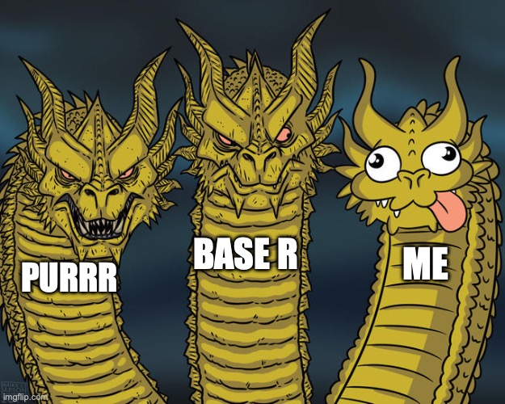

class: left, middle, title-slide


```{r setup, include=FALSE}
options(htmltools.dir.version = FALSE)

library(ggplot2)
library(tidyverse)
library(readr)
library(gridExtra)
library(cowplot)

#library(jtools)


knitr::opts_chunk$set(fig.retina = 3, 
                      warning = FALSE, 
                      message = FALSE)


theme_set(theme_minimal(base_size = 20)) # sets a default ggplot theme

#has_bash <- Sys.which('bash') != '' && .Platform$OS.type != 'windows'

library(RefManageR)
bib <- ReadBib("PracticeR_FINAL.bib", check = FALSE)
ui <- "- "
```

```{r best-features, echo=FALSE}
#search
#xaringanExtra::use_search(show_icon = TRUE, position = "top-right")

xaringanExtra::use_progress_bar(color = "#023047", location = "top")
xaringanExtra::use_panelset()
xaringanExtra::use_clipboard()
xaringanExtra::use_tile_view()

```


```{r xaringan-themer, include=FALSE, warning=FALSE}
library(xaringanthemer)
style_mono_accent(
  base_color = "black",
  header_font_google = google_font("Commissioner"),
  text_font_google   = google_font("EB Garamond"),
  code_font_google   = google_font("Fira Code")
)

```


```{r meta, echo=FALSE}
library(metathis)
meta() %>%
  meta_general(
    description = "Slides: R Programming",
    generator = "Programming with R and purrr",
  ) %>% 
  meta_name("github-repo" = "edgar-treischl/slidesProgramming") %>% 
  meta_social(
    title = "R Programming",
    url = "https://edgar-treischl.github.io/slidesProgramming",
    og_type = "website",
    og_author = "Edgar J. Treischl",
    image = "https://edgar-treischl.github.io/slidesProgramming
/images/preview.png",
    image_alt = "Title Slide"
  )
```


```{r, results='asis', echo=FALSE}
cat(readLines("github-corner.html"), sep = "\n")
```

# R Programming

### <a href="http://www.edgar-treischl.de" target="_blank">Dr. Edgar J. Treischl</a>

.white[Last update: `r Sys.Date()`]

.footnote.slide-footer[
  Press `r emoji::emoji("o")` or `r emoji::emoji("arrow_right")` to navigate
]

<div class="remark-footer"><a href="https://unsplash.com/de/@synkevych" target="_blank" style="color: gray;">Image: Friedrich Justin Bertuch</a></div>


```{css, echo = F}
.reduced_opacity {
  opacity: 0.5;
}
```


---
## Agenda


.pull-left[


### 01 Base R 
### 02 Purrr 
### 03 Purrr and friends 


]

.pull-right[





]

---
background-image: url("images/touch.gif")
background-size: cover
class: bottom, center


# .white[Base R is a Real Beauty `r emoji::emoji("smile")`] 


---
## R Basics

**Functions for data exploration ** 

.pull-left[

```{r}
# View first rows / head of mtcars
head(mtcars)
```


]

.pull-right[

```{r}
# Structure of mtcars
str(mtcars)
```


]


---
## R Basics II

**Functions for data manipulation ** 


.pull-left[


```{r}
# Class of mtcars
class(mtcars)
```

```{r}
# Create a vector/Subset the 2nd element
myvec <- c("This", "is", "awesome")
myvec[3]
```


]

.pull-right[

```{r}
# Subset by condition
head(mtcars[mtcars$cyl == 6, ])

```


]


---
## R Basics III


.pull-left[

#### `r emoji::emoji("left_arrow")` Assignment Operator

```{r}
# AB(C) of the assignment operator
a <- 5
b <- 6

# The result
result <- a + b
result
```


#### `r emoji::emoji("wand")` Assign like a Pro, press:

```{r}
#> < Alt/Option > + < - >
#> (Windows/Unix)
```


]


.pull-right[

#### `r emoji::emoji("toolbox")` Functions


```{r}
# Create a function
randomize <- function(x) {
  sample_x <- sample(x, 1)
  return(sample_x)
}

# Call and feed the function
randomize(x = c(3, 2, 1, 5, 8, 12, 1))
```

#### `r emoji::emoji("magic")` Snippet your way, in RStudio, type: 

```{r}
#> `fun` and press `<Tab>`
```


]


---
## R Basics Summary

.pull-left[


- **Data Exploration**
  - `head/tail(x)` – view first/last rows  
  - `str(x)` – structure of an object  
  - `names(x)` – column or element names
  - `class(x)` – object class

- **Indexing and Subsetting**
  - `x[i]` – subset vector  
  - `x[i, j]` – subset matrix/data.frame  
  - `x[condition]` – logical indexing  
  - `subset(x, condition)` – filter rows

- **Vector & Sequence Operations**
  - `c()` – combine values into a vector  
  - `seq()`, `rep()` – generate sequences/repeats  
  - `sort(x)` – sort a vector  
  - `rev(x)` – reverse elements
  - `length(x)` – length of a vector


]

.pull-right[

- **Basic Math & Statistics**
  - `sum(x)`, `prod(x)` – sum/product  
  - `mean(x)`, `median(x)`, `var(x)`, `sd(x)` – statistics
  ...

- **Logical & Comparison**
  - `==`, `!=`, `<`, `>`, `<=`, `>=` – comparisons  
  - `&`, `|`, `!` – logical AND, OR, NOT  
  - `any()`, `all()` – check logical conditions over vectors

- **Object Manipulation**
  - `cbind()`, `rbind()` – combine matrices or data frames  
  - `merge()` – join data frames  
  - `dimnames()` – get/set row/column names  
  - `replicate()` – repeat expressions


]


---
## Base R (1/4)


.pull-left[


#### `r emoji::emoji("one")` Functions as first-class objects
  - you can assign functions to variables, pass them as arguments, and return them from other functions

```{r}
# Assigning a function to a variable
f <- sum       
f(1:5)

# Passing a function as an argument
apply_fun <- function(x, fun) {
  fun(x)
}

apply_fun(1:5, mean)
```


]

.pull-right[

#### `r emoji::emoji("ghost")` Anonymous functions
  - functions without names, useful for inline transformations
  - anonymous functions are created on the fly using the `function` keyword and can be passed directly as arguments to other functions
  
  
```{r}
# Anonymous functions: for inline transformations
sapply(1:5, function(x) x^2)
```


]


---
## Base R (2/4)

.pull-left[

**Apply family** – `lapply()`, `sapply()`, `vapply()`, enable iteration without loops. For example, sapply() applies a function to each element and simplifies the output to a vector or matrix when possible.

```{r}

# Apply family
sapply(iris[1:4], mean)

# Apply family
mapply(sum, 1:3, 4:6)


```


]

.pull-right[

**Closures / lexical scoping** – A closure is a function that captures (or “closes over”) variables from its surrounding environment — meaning it remembers the values that existed when it was created.  


```{r}

# A closure
make_power <- function(n) {
  function(x) x^n
}

square <- make_power(2)  
square(4)

```


]


---
## Base R (3/4)

.pull-left[


**Pure functions** – functions without side effects (e.g. data export, printing), producing predictable results. Impure functions break predictability, reproducibility, testability, and parallel safety.

```{r}
# Impure function
x <- 5

add_to_x <- function(y) {
  x <<- x + y  # modifies a global variable
  return(x)
}

add_to_x(3)

add_to_x(2)
```


]

.pull-right[

**For-loop** – repeat operations over a sequence of values.


```{r}
# For-loop
squares <- numeric(5)

for(i in 1:5) {
  squares[i] <- i^2
}
squares

```


Useful for iterative tasks, but vectorized alternatives (like `sapply`) are often more concise and faster.


]


---
## Base R (4/4)

.pull-left[

**Vectorization** – performing operations on entire vectors at once, avoiding explicit loops. Leads to **faster, simpler, and more readable code**.


```{r}
x <- 1:5

# Loop version (slower)
squares_loop <- numeric(length(x))
for(i in seq_along(x)) {
  squares_loop[i] <- x[i]^2
}

# Vectorized version (faster)
squares_vec <- x^2
squares_vec

```


]

.pull-right[

**Pipe operator (`%>%`)** – passes the output of one expression as the input to the next, enabling **clear, readable, and sequential transformations**.


```{r}
#> Make the native pipe (|>) the default
#> Cmd + Shift + M 

mtcars |> 
  filter(cyl == 6) |> 
  mutate(power_to_weight = hp / wt) |> 
  summarise(avg_ptw = mean(power_to_weight))
```

Pipelines are great for creating linear, readable code, but when a single chain becomes too long or complex, it’s better to break it into smaller, named steps for clarity.

]


---
background-image: url("images/nice_dragon.gif")
background-size: cover
class: bottom, center


# .white[Just like purrr ... <br> `r emoji::emoji("cat")`] 


---
## Hello Purrr

.pull-left[

<div class="info-box">
  <i>`r emoji::emoji("parrot")`</i> The purrr package helps you avoid repetitive code (Wickham and Henry 2025). The package is part of the tidyverse and provides a consistent, readable way to perform iteration in R. Instead of writing loops or repeating function calls manually, purrr lets you apply functions over lists, vectors, or data frames using a family of tools like map, map2, and pmap.
</div>


]

.pull-right[
<figure>
    <a href="https://purrr.tidyverse.org" target="_blank">
    </a>
</figure>
]


---
background-image: url(https://purrr.tidyverse.org/logo.png)
background-position: 90% 5%
background-size: 8%

## map

.pull-left[

The heart of `purrr` is its **mapping functions**, which let you apply a function systematically across a list, vector, or multiple inputs.

<div style="text-align: center;">
  <a href="https://adv-r.hadley.nz/index.html" target="_blank">
    
  </a>
  <p style="font-size: 0.8em; text-align: center;">
    <em>Artwork: Hadley Wickham</em>
  </p>
</div>


The `map()` function applies a function to each element of a list or vector and **always returns a list**.

]

.pull-right[
```{r}
# Create a list of numeric vectors
num_list <- list(a = 1:5, 
                 b = 6:10, 
                 c = 11:15)

# Use map() to calculate the mean of each vector
map(num_list, mean)

```
]


---
background-image: url(https://purrr.tidyverse.org/logo.png)
background-position: 90% 5%
background-size: 8%

## map

.pull-left[

Each result is a list element, keeping the structure consistent. If you want a specific type of output, `purrr` provides **type-specific variants** that guarantee the output type, making your code more predictable and reducing subtle bugs.

- `map_dbl()` – returns a numeric vector
- `map_chr()` – returns a character vector
- `map_int()` – returns an integer vector
- `map_lgl()` – returns a logical vector
- `map_df()` – returns a data frame


]

.pull-right[

```{r}
# Using type-specific variants
map_df(mtcars, mean)
map_chr(mtcars, class)

```
]


---
background-image: url(https://purrr.tidyverse.org/logo.png)
background-position: 90% 5%
background-size: 8%
## map2 – iterating over two inputs

.pull-left[

`map2()` is used when you want to **apply a function to two vectors or lists at the same time**, element by element. 

<div style="text-align: center;">
  <a href="https://adv-r.hadley.nz/index.html" target="_blank">
    
  </a>
  <p style="font-size: 0.8em; text-align: center;">
    <em>Artwork: Hadley Wickham</em>
  </p>
</div>

So, `map2()` takes three main arguments:  
  1. The first input vector or list (`.x`)  
  2. The second input vector or list (`.y`)  
  3. The function to apply to each pair of elements 


]

.pull-right[


```{r}
column_names <- names(mtcars)
column_means <- map_dbl(mtcars, mean)

map2result <- map2_chr(
  column_names,
  column_means, ~ paste(
    .x, "mean =",
    round(.y, 1)
  )
)
map2result[1:3]

```

Here, `.x` refers to an element from the first vector (`column_names`), and `.y` refers to the corresponding element from the second vector (`column_means`). The tilde (`~`) creates an anonymous function, keeping the code concise.

]


---
background-image: url(https://purrr.tidyverse.org/logo.png)
background-position: 90% 5%
background-size: 8%
## pmap – iterating over multiple inputs

.pull-left[

When you have **more than two inputs**, `pmap()` generalizes this idea. It takes a **list of vectors or lists** and applies a function to corresponding elements across all inputs.

<div style="text-align: center;">
  <a href="https://adv-r.hadley.nz/index.html" target="_blank">
    
  </a>
  <p style="font-size: 0.8em; text-align: center;">
    <em>Artwork: Hadley Wickham</em>
  </p>
</div>


]

.pull-right[

Imagine we want to combine column names, means, and standard deviations:

```{r}
column_sds <- map_dbl(mtcars, sd)
inputs <- list(column_names, column_means, column_sds)

pmamp_result <- pmap(
  inputs,
  ~ paste(
    ..1, " with a mean =", round(..2, 1),
    " and a sd =", round(..3, 1)
  )
)

```


]


---
background-image: url(https://purrr.tidyverse.org/logo.png)
background-position: 90% 5%
background-size: 8%
## pmap II

```{r}
# Show the first 3 results of the list
pmamp_result[1:3]
```


Here, `..1`, `..2`, `..3` refer to elements from the first, second, and third lists, respectively. `pmap()` allows you to work cleanly with **any number of parallel inputs**, keeping your code short and readable while avoiding nested loops.


---
background-image: url("images/leuchtturm.gif")
background-size: cover
class: bottom, center


# .white[FP in Action `r emoji::emoji("fist")`] 

---
## Example: Reading and Cleaning Data


Imagine, a folder full of CSV files, all with the same structure, and we need to import them and clean the column names.

.pull-left[


#### The manual `r emoji::emoji("hand")` approach


```{r, eval=FALSE}
df1 <- read.csv("df1.csv")
df1 <- janitor::clean_names(df1)
...
df101 <- read.csv("df101.csv")
```


Solving this task manually quickly becomes tedious and error-prone. 


]

.pull-right[


#### The `r emoji::emoji("loop")` loooop


```{r}
files <- list.files("data", pattern = "*.csv", full.names = TRUE)
dfs <- list()

for (i in seq_along(files)) {
  df <- read.csv(files[i])
  df <- janitor::clean_names(df)
  dfs[[i]] <- df
}
```


]

The loop works, is better a manual approch, but there are some downsides:
- You have to manually manage the **index** `i` and the `dfs` list.
- The code is **verbose**, with variables that can clutter your workspace.
- It’s **less composable**, making it harder to fit into a pipe-based workflow or reuse as a function.


---
## Example: Reading and Cleaning Data

Function programming with purrr is often cleaner, safer, and easier to maintain: 

.pull-left[

- **No manual indexing** — `map()` takes care of iterating over each file automatically. No need to track `i` or worry about list positions.  
- **Clean and readable** — the workflow reads top-down: read the file, clean the names, done. No clutter from intermediate variables.  
- **Predictable and type-safe** — `map()` always returns a list, so `dfs` is consistent and reliable.  
- **Easily reusable** — wrap this logic in a function, and you can apply it to any folder of files without rewriting the loop.


]

.pull-right[

#### Hallo `r emoji::emoji("cat")`


```{r, eval=FALSE}
library(purrr)
library(janitor)

files <- list.files("data", pattern = "*.csv", full.names = TRUE)

dfs <- files |>
  map(read.csv) |>
  map(clean_names)
```


]


---
## Example: Creating Multiple Plots


.pull-left[

- `imap()` iterates over both the **values** and **names** of each column in `mtcars`.  
- For every column (`.x`), it checks if it’s numeric using `is.numeric(.x)`.  
- If it is, a `ggplot` histogram is created.
- The column name (`.y`) is used dynamically in the plot title.  
- All resulting plots are stored neatly in a **list object** called `plots`, ready for display or export.


]

.pull-right[


```{r}
library(ggplot2)
library(purrr)

# Create a histogram for each numeric column
plots <- imap(mtcars, ~ {
  if(is.numeric(.x)) {
    ggplot(mtcars, aes(x = .x)) +
      geom_histogram(bins = 10, fill = "steelblue") +
      ggtitle(paste("Histogram of", .y))
  }
})

# A list of plots
class(plots)


```


]

When iterating over many elements, not every operation will go smoothly — some columns might be non-numeric, a plot might fail to render, or a transformation could throw an error.

---
background-image: url("images/cartoon.gif")
background-size: cover
class: bottom, center


# .white[Purrr and friends to slay the `r emoji::emoji("dragon")`] 


---
background-image: url(https://purrr.tidyverse.org/logo.png)
background-position: 90% 5%
background-size: 8%
## safely

.pull-left[

`safely()` **catches errors** and returns them as part of the output, rather than halting execution. It transforms a function that always returns a **list** with two elements:

- `result`: the output (or `NULL` if an error occurred)  
- `error`: the error message (or `NULL` if everything worked)


```{r, warning=TRUE, error = TRUE}
# Some test inputs
data_list <- list(
  c("a", "b", "c"),
  c(1, 2, 3)
)

mean(data_list[[1]])
```


]

.pull-right[


```{r}
# Wrap mean() safely
safe_mean <- safely(mean)

# Apply safely-wrapped mean() to each element
results <- map(data_list, safe_mean)

# Extract via map
numeric_results <- map(results, "result")
errors <- map(results, "error")

# Keep only successful numeric results and simplify to a vector
flatten_dbl(compact(numeric_results))


```


]

---
background-image: url(https://purrr.tidyverse.org/logo.png)
background-position: 90% 5%
background-size: 8%
## possibly

.pull-left[

`possibly()` **replaces errors with a default value** rather than halting execution. It transforms a function so that if an error occurs, it returns a **fallback value** you specify (via `.otherwise`).

This is useful when you want to keep going but don’t need the error details.

```{r, warning=TRUE, error=TRUE}
# Function
do <- function(x) {
  if (!is.numeric(x)) stop("Not numeric!")
  mean(x)
}

# Test inputs
data_list <- list(
  "a",          
  c(1, 2, 3)
)
```

]

.pull-right[


```{r}
# Wrap with possibly()
safe_test2 <- possibly(do, otherwise = NA_real_)
map_dbl(data_list, safe_test2)

```

Here, instead of stopping (or returning lists of errors),
possibly() returns the numeric fallback NA for the failed call and proceeds smoothly.

]

---
background-image: url(https://purrr.tidyverse.org/logo.png)
background-position: 90% 5%
background-size: 8%
## walk


.pull-left[

- The `walk()` function is perfect for operations that have **side effects**, such as saving files, printing messages, or generating plots. 

- It behaves just like `map()`, but it **returns nothing**, keeping your workflow clean when you only care about the action being performed.

- Plus: The `.progress = TRUE` option automatically shows a progress bar while mapping, which is invaluable for long-running tasks.


]

.pull-right[

For example, after creating your list of plots, you can easily export them all at once:

```{r, eval=FALSE}
library(purrr)
library(ggplot2)

# Save each plot to file
walk(names(plots), ~ {
  ggsave(
    filename = paste0(.x, "_plot.png"),
    plot = plots[[.x]],
    width = 6,
    height = 4
  )
})

```

]


---
background-image: url(https://purrr.tidyverse.org/logo.png)
background-position: 90% 5%
background-size: 8%
## quietly

.pull-left[

`quietly()` **captures all output** generated by a function. It returns a **list** with four elements:

- `result`: the function output (or `NULL`)  
- `output`: captured printed output  
- `warnings`: any warnings generated  
- `messages`: any messages generated

This is useful when you want to **run a function silently** but still inspect what happened.

```{r, warning=TRUE, message=TRUE}
# Example function
example_fun <- function(x) {
  message("A message")
  warning("A warning")
  print(x)
  x + 1
}

```

]

.pull-right[


```{r}
library(purrr)

# Wrap the function quietly
quiet_fun <- quietly(example_fun)

# Apply to a value
result <- quiet_fun(5)

# Inspect the result/output/etc.
result$result
```

All output, warnings, and messages are captured in the list elements for inspection.
]

]


---
background-image: url(https://purrr.tidyverse.org/logo.png)
background-position: 90% 5%
background-size: 8%
## Parallel Processing


.pull-left[

- When performance is important — say you’re generating hundreds of plots or running computationally‑heavy tasks — the parallel capabilities of `purrr` come into play. 

- Starting with version 1.2.0, `purrr` supports parallel execution via the `in_parallel()` “adverb”.

- Parallelism can significantly speed up operations by distributing tasks across multiple CPU cores. The latter is also a advanced topic which is why we only touch it briefly here.

```{r, eval=FALSE}
# Prepare inputs
column_names <- names(mtcars)
column_data  <- mtcars
# Ensure daemons are running
mirai::daemons(4)
mirai::require_daemons()
```


]

.pull-right[

- We can export the list of plots in parallel:

```{r, eval=FALSE}
# Export histograms in parallel
plots_parallel <- map2(
  column_names, column_data,
  ~ in_parallel(
      \(col_name, data) {
        ggplot2::ggplot(data, ggplot2::aes(x = .data[[col_name]])) +
          ggplot2::geom_histogram(bins = 10, fill = "steelblue") +
          ggplot2::ggtitle(paste("Histogram of", col_name))
      },
      col_name  = .x,
      data      = .y
    )
)
```


]


---
class: right, middle


## Thank you for your attention!


[`r icons::fontawesome("rocket")` www.edgar-treischl.de](https://www.edgar-treischl.de)

[`r icons::fontawesome("github")` edgar-treischl](https://github.com/edgar-treischl)

[`r icons::fontawesome("envelope")` edgar.treischl@isb.bayern.de](mailto:edgar.treischl@isb.bayern.de)


---
class: right, middle


## Licence

This presentation is licensed under a CC-BY-NC 4.0 license.
You may copy, distribute, and use the slides in your own work, as long as you give attribution to the original author on each slide that you use. Commercial use of the contents of these slides is not allowed.
<br/>
<br/>


